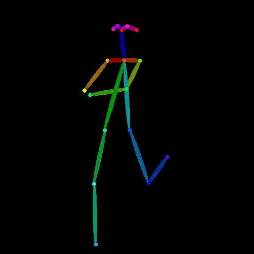

# vid2openpose Cog model

This is an implementation of vid2openpose as a [Cog](https://github.com/replicate/cog) model.

## Development

Follow the [model pushing guide](https://replicate.com/docs/guides/push-a-model) to push your own model to [Replicate](https://replicate.com).

## Basic Usage

Run a prediction

    cog predict -i video=@demo.mp4

# Example

